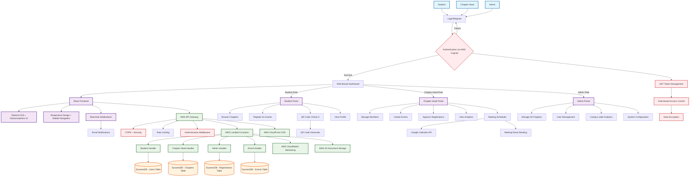

```mermaid
graph TD
    %% User Types
    A[Student] --> B[Login/Register]
    C[Chapter Head] --> B
    D[Admin] --> B
    
    %% Authentication Flow
    B --> E{Authentication via AWS Cognito}
    E -->|Success| F[Role-Based Dashboard]
    E -->|Failure| B
    
    %% Frontend Layer
    F --> G[React Frontend]
    G --> H[Tailwind CSS + Glassmorphism UI]
    G --> I[Responsive Design + Mobile Navigation]
    G --> J[Real-time Notifications]
    
    %% User Dashboards
    F -->|Student Role| K[Student Portal]
    F -->|Chapter Head Role| L[Chapter Head Portal]
    F -->|Admin Role| M[Admin Portal]
    
    %% Student Features
    K --> N[Browse Chapters]
    K --> O[Register for Events]
    K --> P[QR Code Check-in]
    K --> Q[View Profile]
    
    %% Chapter Head Features
    L --> R[Manage Members]
    L --> S[Create Events]
    L --> T[Approve Registrations]
    L --> U[View Analytics]
    L --> V[Meeting Scheduler]
    
    %% Admin Features
    M --> W[Manage All Chapters]
    M --> X[User Management]
    M --> Y[Campus-wide Analytics]
    M --> Z[System Configuration]
    
    %% API Gateway Layer
    G --> AA[AWS API Gateway]
    AA --> BB[CORS + Security]
    AA --> CC[Rate Limiting]
    AA --> DD[Authentication Middleware]
    
    %% Backend Services
    AA --> EE[AWS Lambda Functions]
    EE --> FF[Student Handler]
    EE --> GG[Chapter Head Handler]
    EE --> HH[Admin Handler]
    EE --> II[Event Handler]
    
    %% Database Layer
    FF --> JJ[(DynamoDB - Users Table)]
    GG --> KK[(DynamoDB - Chapters Table)]
    HH --> LL[(DynamoDB - Registrations Table)]
    II --> MM[(DynamoDB - Events Table)]
    
    %% Additional Services
    EE --> NN[AWS CloudWatch Monitoring]
    EE --> OO[AWS S3 Document Storage]
    AA --> PP[AWS CloudFront CDN]
    
    %% External Integrations
    V --> QQ[Google Calendar API]
    V --> RR[Meeting Room Booking]
    P --> SS[QR Code Generator]
    J --> TT[Email Notifications]
    
    %% Security Layer
    E --> UU[JWT Token Management]
    UU --> VV[Role-Based Access Control]
    VV --> WW[Data Encryption]
    
    %% Styling
    classDef userClass fill:#e1f5fe,stroke:#01579b,stroke-width:2px
    classDef frontendClass fill:#f3e5f5,stroke:#4a148c,stroke-width:2px
    classDef backendClass fill:#e8f5e8,stroke:#1b5e20,stroke-width:2px
    classDef databaseClass fill:#fff3e0,stroke:#e65100,stroke-width:2px
    classDef securityClass fill:#ffebee,stroke:#c62828,stroke-width:2px
    
    class A,C,D userClass
    class G,H,I,J,K,L,M frontendClass
    class AA,EE,FF,GG,HH,II,NN,OO,PP backendClass
    class JJ,KK,LL,MM databaseClass
    class E,UU,VV,WW,BB,DD securityClass
```
